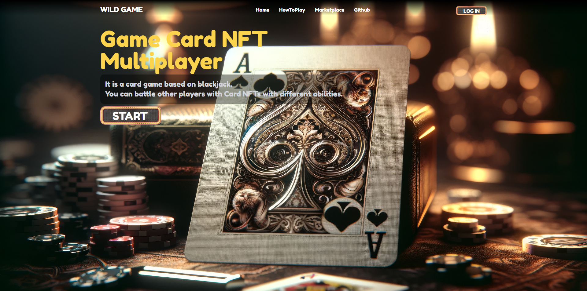
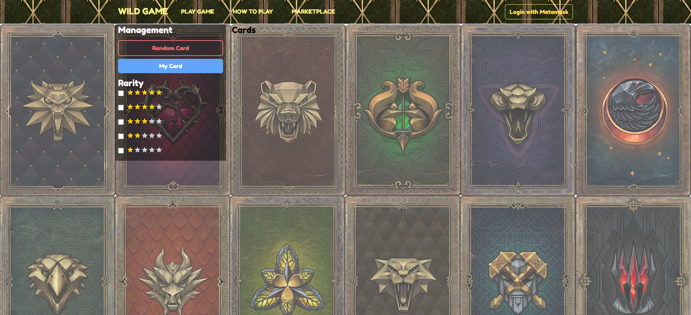
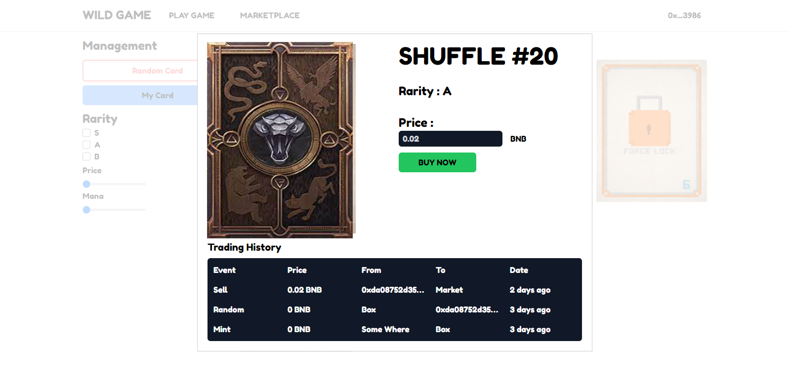
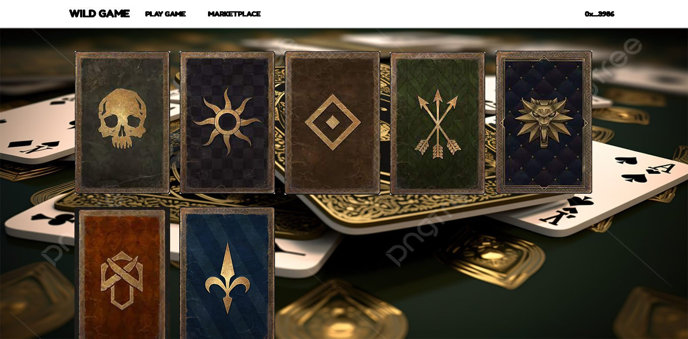

# ♠️ NFT Blackjack Multiplayer Game

A multiplayer blackjack game powered by **NFT cards** and built using **Godot (v3.4)** with **Nakama** for real-time multiplayer. Players log in via **Metamask**, and all smart contract logic runs on the **Binance Smart Chain Testnet**.

Originally developed using Unity and Photon, this project now runs entirely in Godot for a more streamlined and open-source-friendly experience.

---

## 🃏 Gameplay

Battle other players using NFT-based cards—each card has unique abilities that can influence your strategy and turn the odds in your favor.

---

## 🖼️ Screenshots

  
  
  


---

## 🔄 How Multiplayer Works

Multiplayer logic is turn-based and message-driven.  
Think of it like two friends playing chess remotely:

- If I move a piece from `d2` to `d3`, I send that action to my opponent.
- When my opponent moves `d7` to `d6`, they send it back to me.

This ensures both clients stay synchronized in real time.

---

## 🛠 Smart Contract

Smart contracts are written and deployed using **Hardhat** on the Binance Smart Chain Testnet.

**Sample transaction:**  
https://testnet.bscscan.com/token/0xe97bd2b6b71647f0c3517613f19f8c561b98a7e8

---

## 🚀 Getting Started

### 🎮 Game Setup (Godot v3.4)
1. Get a **Moralis API Server** from [moralis.io](https://moralis.io/) (select Binance Testnet).
2. Open the project in **Godot 3.4**.
3. Go to the **Login Screen**, select the **Login Node**, and update the `Server URL` and `App ID` on the right side.
   - If not visible, open the Login script and edit the values directly.
4. In `ServerConnect.gd`, make sure Nakama is pointing to your IP (check line 3).

---

### 🦊 Metamask & BNB

To get test BNB:  
https://testnet.binance.org/faucet-smart

---

### 📦 Deploying Your Own Smart Contract

1. Open `secret.json` and replace the private key with your **Metamask private key**, prefixed with `0x`.
2. Install dependencies:
   ```bash
   npm install
